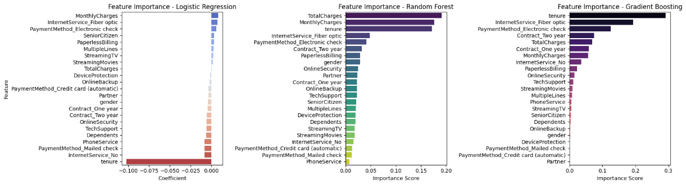
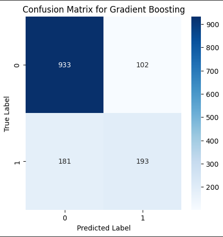
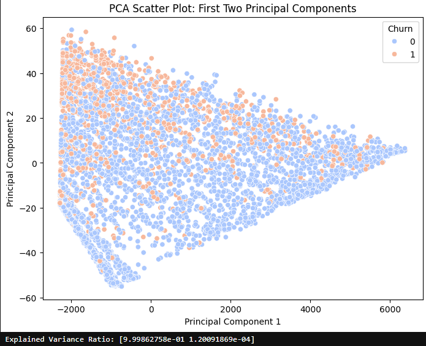
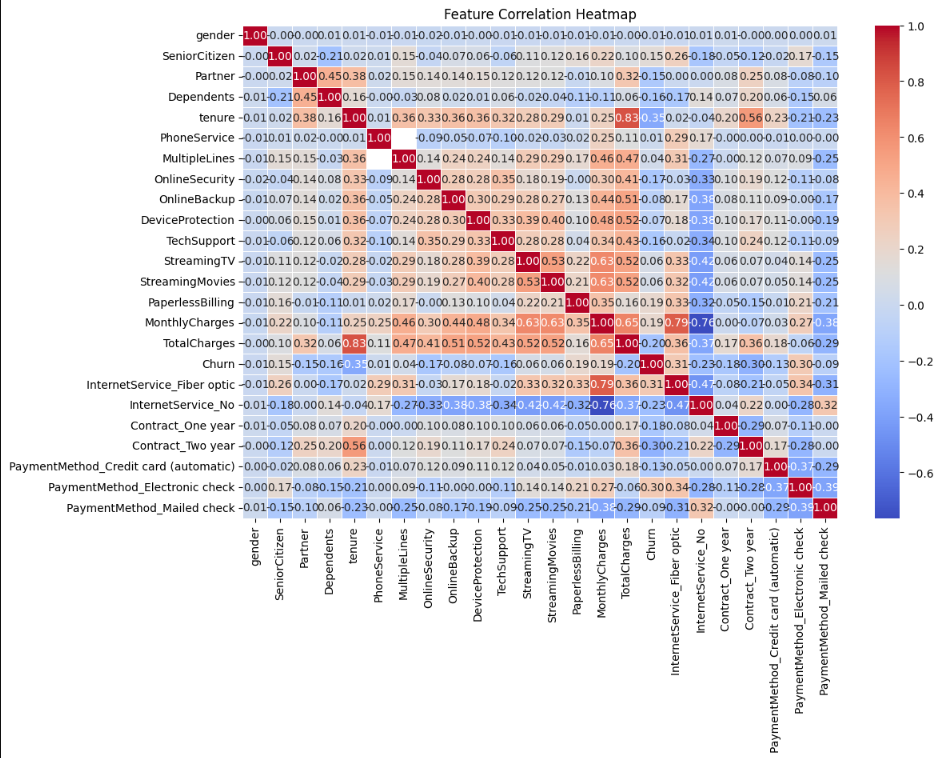
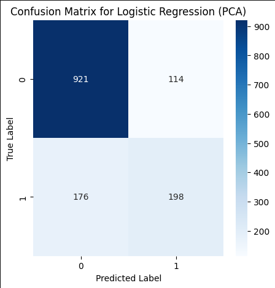

# **📌 Customer Churn Prediction & Analysis**

## **📖 Overview**
Customer churn is a significant concern for subscription-based businesses. This project explores machine learning models to predict customer churn in the **Telco Customer Churn dataset** and applies **Principal Component Analysis (PCA)** to uncover patterns. The goal is to provide actionable insights for **reducing churn and improving customer retention**.

### **Key Goals:**
- **Identify the primary factors influencing churn.**
- **Compare multiple machine learning models to optimize predictive performance.**
- **Leverage PCA for dimensionality reduction and visualization.**
- **Prepare processed datasets for Power BI integration.**

---

## **🛠 Data Preprocessing**
Before training machine learning models, extensive preprocessing was performed:
- **Missing values handled** – `TotalCharges` was imputed with the median.
- **Categorical features encoded** – One-hot encoding was used for categorical variables.
- **Numeric features scaled** – StandardScaler was applied to ensure proper model performance.
- **Data split** – The dataset was divided into **80% training, 20% test sets**.
- **Exported datasets for Power BI:**
  - ✅ `Telco_Customer_Churn_Processed.csv` (fully encoded dataset for modeling)
  - ✅ `Telco_Customer_Churn_PCA.csv` (PCA-transformed dataset for visualization)

---

## **📊 Feature Importance Analysis**
Feature importance was evaluated using **Logistic Regression, Random Forest, and Gradient Boosting** to determine key predictors of churn.

### **Top churn risk factors:**
- **Shorter tenure** – New customers are more likely to churn.
- **Fiber optic internet users** – Churn rate is higher compared to DSL or No Internet.
- **Month-to-month contracts** – These customers have the highest churn rates.
- **Electronic check payments** – Customers paying via electronic check are more likely to leave.

### **Factors reducing churn:**
- **Two-year contracts** – Longer commitments reduce churn risk.
- **Tech support and security add-ons** – Additional services improve customer retention.
- **Higher total charges** – Customers who have invested more in the service tend to stay.

#### **Feature Importance Visualizations:**

- **Logistic Regression (left):** Tenure and Internet Service type strongly influence churn.
- **Random Forest (middle):** TotalCharges and MonthlyCharges are the most critical factors.
- **Gradient Boosting (right):** Tenure remains a major predictor, followed by Internet Service type and Payment Method.

---

## **📈 Model Performance**
Three different machine learning models were trained and compared:

| Model                 | Accuracy  |
|----------------------|----------|
| Logistic Regression  | **77.36%** |
| Random Forest       | 78.71% |
| Gradient Boosting   | **79.91%** |

🏆 **Best Model:** **Gradient Boosting (79.91%)**
Gradient Boosting provided the best accuracy, slightly outperforming Random Forest.

#### **Confusion Matrix for Gradient Boosting:**

- **True Negatives (933):** Correctly identified non-churners.
- **True Positives (193):** Correctly identified churners.
- **False Negatives (181):** Missed churners.
- **False Positives (102):** Incorrectly flagged churners.

### **Key Takeaways:**
- The **model predicts non-churners well**, but **struggles with churners** (false negatives).
- **Improving recall (catching more churners) should be a priority.**

---

## **📌 PCA Analysis & Correlation Insights**
Principal Component Analysis (PCA) was applied to visualize churn patterns and feature relationships.

### **PCA Scatter Plot**

- The **first two principal components explain ~50% of variance**.
- Some churn separation is visible, but churn patterns are **not fully distinct**.

### **Feature Correlation Heatmap**

- **Tenure and TotalCharges are highly correlated**, confirming long-term customers spend more.
- **Contract type strongly impacts churn risk**, reinforcing the importance of converting month-to-month users.

### **PCA Model Performance**
We also tested models trained **after PCA transformation** to observe its impact.

| Model (PCA)            | Accuracy  |
|----------------------|----------|
| Logistic Regression (PCA) | 79.42% |
| Random Forest (PCA)      | 77.22% |
| Gradient Boosting (PCA)  | 78.21% |

#### **Confusion Matrix for Logistic Regression (PCA):**

- PCA slightly improved **Logistic Regression accuracy**.
- **No significant improvement for Random Forest or Gradient Boosting.**

### **Key Takeaways from PCA:**
- PCA **reduced dimensionality** but **did not significantly boost predictive accuracy**.
- **Feature engineering may yield better improvements** than PCA alone.

---

## **🚀 Business Recommendations**

✅ **Convert At-Risk Customers to Long-Term Contracts**
   - Offer **discounts or loyalty perks** to month-to-month customers.
   - Encourage **automatic renewals** to improve retention.

✅ **Address Fiber Optic Customer Churn**
   - Investigate **service quality concerns** or pricing issues.
   - Implement **loyalty rewards** for high-speed internet users.

✅ **Optimize Payment Method Options**
   - **Electronic check payments correlate with churn** → Incentivize auto-pay or credit card payments.
   - Provide **better customer support for electronic check users**.

✅ **Improve Retention with Targeted Campaigns**
   - Focus retention efforts on **new customers with short tenure**.
   - Use **personalized marketing to engage high-risk segments**.

---

### **📢 Final Takeaway:**
By leveraging **machine learning and predictive analytics**, we have uncovered **critical churn drivers** and provided **actionable business strategies**. Implementing these findings can **improve customer retention, increase revenue, and reduce churn rates.** 🚀

